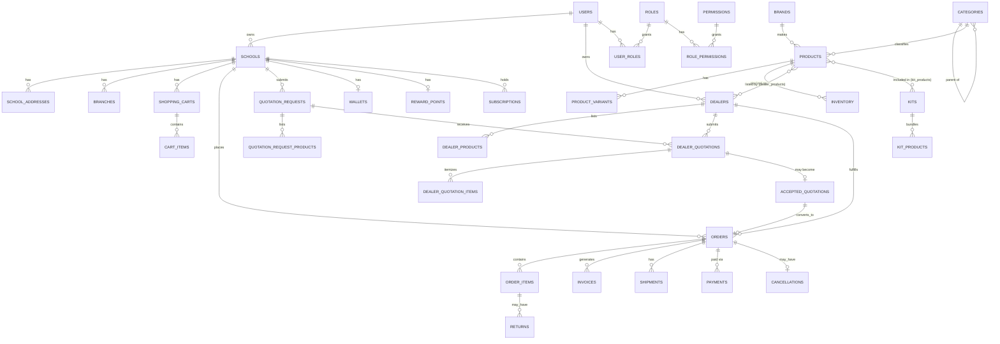

# The EduNest — Database Architecture Documentation

Companion document to `edunest_database_schema.sql`. That file is the source of truth for column-level detail (every table's purpose is documented inline as SQL comments); this document covers everything that spans multiple tables: relationships, performance strategy, security, and operational conventions.

**Engine:** MySQL 8.0+ | **Storage:** InnoDB | **Charset/Collation:** utf8mb4 / utf8mb4_0900_ai_ci
**Scale target:** 100,000+ schools, millions of products, millions of orders
**Verification:** the full schema (138 tables, 197 foreign keys) was executed end-to-end against a live MySQL-compatible server during authoring — every `CREATE TABLE`, constraint, and partition definition is confirmed syntactically valid, not just hand-written.

---

## 1. Module Map

| # | Module | Tables |
|---|--------|--------|
| 1 | Authentication | roles, permissions, role_permissions, users, user_roles, sessions, password_resets, otps, login_history, device_tokens |
| 2 | Schools | schools, school_profiles, school_addresses, branches, school_documents |
| 3 | Dealers | dealers, dealer_addresses, dealer_products, dealer_ratings, dealer_reviews, dealer_documents, dealer_availability |
| 4 | Catalog | categories, brands, products, product_images, product_videos, specifications, attributes, attribute_values, product_variants, product_variant_attributes, inventory, stock_history, price_history, tags, product_tags, collections, collection_products |
| 5 | Preschool Kits | kit_categories, kits, kit_products, kit_pricing, kit_images |
| 6 | Curriculum | curriculum_solutions, books, worksheets, teacher_kits, assessments, certificates, downloads |
| 7 | Branding | branding_services, uniform_designs, id_cards, printing_services, website_services, branding_gallery |
| 8 | Cart & Wishlist | shopping_carts, cart_items, wishlists, wishlist_items, recently_viewed |
| 9 | Orders | orders, order_items, order_status_history, order_timeline, order_notes, returns, cancellations, refunds, invoices, invoice_items, shipments, tracking, delivery_updates |
| 10 | Quotations | quotation_requests, quotation_request_products, dealer_quotations, dealer_quotation_items, quotation_comparisons, quotation_status_history, accepted_quotations |
| 11 | Payments | payment_methods, payments, payment_transactions, wallets, wallet_history, reward_points, reward_history, coupons, coupon_usage, taxes |
| 12 | Subscriptions | plans, plan_features, subscriptions, subscription_payments, renewals |
| 13 | Learning | learning_categories, blogs, learning_videos, learning_downloads, teacher_trainings, success_stories, resources |
| 14 | Events | events, event_registrations, event_attendance, event_certificates |
| 15 | Support | support_tickets, ticket_replies, faqs, live_chats, live_chat_messages, feedback |
| 16 | Notifications | notifications, notification_settings, email_queue, sms_queue, push_queue |
| 17 | Dashboard | analytics_snapshots, dashboard_widgets, recent_activity, announcements |
| 18 | File Storage | uploaded_files, media, documents, attachments |
| 19 | Settings | application_settings, school_settings, dealer_settings, payment_settings, email_settings, sms_settings, theme_settings |
| 20 | Audit | audit_logs, activity_logs, error_logs, api_logs |

---

## 2. Naming Conventions

- **Tables:** `snake_case`, plural (`schools`, `order_items`).
- **Columns:** `snake_case`.
- **Primary keys:** `id BIGINT UNSIGNED AUTO_INCREMENT` — fast, sequential, InnoDB-clustered-index-friendly. Every table also carries a `uuid CHAR(36) DEFAULT (UUID())` for public/external-facing identifiers (API responses, URLs) so internal auto-increment IDs are never exposed.
- **Foreign keys:** `<referenced_table_singular>_id`, e.g. `school_id`, `dealer_id`.
- **Constraint names:** `fk_<table>_<target>`, `uq_<table>_<column>`, `chk_<table>_<rule>`, `idx_<table>_<columns>` — predictable and greppable in migrations.
- **Booleans:** `is_<state>` as `TINYINT(1)`.
- **Timestamps:** `created_at`, `updated_at` (both auto-managed), `deleted_at` for soft deletes (nullable — `NULL` = not deleted).
- **Money:** `DECIMAL(12,2)` everywhere (never FLOAT/DOUBLE), paired with a `currency CHAR(3)` column where multi-currency is plausible.
- **Enumerations:** `ENUM` for small, code-controlled, rarely-changing sets (order status, user type). Business-managed or metadata-rich sets (categories, tags, taxes) are lookup tables instead — this is the standard 3NF trade-off: ENUM avoids a join for cheap, stable values; a table is used the moment the set needs its own attributes, growth, or admin UI.

---

## 3. Entity Relationships

### 3.1 Core relationship diagram (primary flows)



### 3.2 Relationship cardinality reference

**One-to-One**
- `schools` ↔ `school_profiles` (extended profile split out to keep the core `schools` row lean)
- `schools` ↔ `wallets`, `schools` ↔ `reward_points`
- `dealer_ratings` ↔ `dealer_reviews`
- `orders` ↔ `cancellations`
- `event_registrations` ↔ `event_attendance`, `event_registrations` ↔ `event_certificates`

**One-to-Many**
- `users` → `schools` / `dealers` (one login can, in principle, own one school or dealer profile; modeled 1:M for future multi-entity ownership)
- `schools` → `school_addresses`, `branches`, `orders`, `quotation_requests`, `support_tickets`
- `products` → `product_images`, `product_videos`, `specifications`, `product_variants`
- `orders` → `order_items`, `order_status_history`, `order_timeline`, `shipments`
- `dealers` → `dealer_products`, `dealer_addresses`, `dealer_quotations`
- `categories` → `categories` (self-referencing `parent_id`, satisfies the "sub-categories" requirement without a duplicate table and supports unlimited depth)

**Many-to-Many (bridge tables)**
| Bridge table | Connects | Extra columns carried |
|---|---|---|
| `dealer_products` | dealers ↔ products | dealer_price, stock_qty, dealer_sku |
| `product_tags` | products ↔ tags | — |
| `collection_products` | collections ↔ products | display_order |
| `kit_products` | kits ↔ products | quantity, is_optional |
| `product_variant_attributes` | product_variants ↔ attribute_values | — |
| `role_permissions` | roles ↔ permissions | — |
| `user_roles` | users ↔ roles | assigned_at |

**Cascade rules (summary)**
- **CASCADE** is used where the child is meaningless without the parent (e.g. `order_items` when an `orders` row is deleted, `cart_items` when a `shopping_carts` row is deleted, `dealer_products` when a `dealers` row is deleted).
- **RESTRICT** protects rows that other financial/legal records depend on (e.g. you cannot delete a `schools` row that owns `orders`, or a `categories` row that still classifies `products`).
- **SET NULL** is used for optional, historical references where losing the link is acceptable but the child record should survive (e.g. `order_items.product_id` if a product is later deleted — the `item_name_snapshot` preserves what was actually sold).
- Every table also carries `deleted_at` for soft deletes; hard `ON DELETE` rules are the backstop for genuinely destructive operations (e.g. GDPR erasure), while normal day-to-day "deletion" in the app should set `deleted_at` and leave FKs untouched.

---

## 4. Performance Strategy

### 4.1 Indexing
- Every FK column has a supporting index (either the FK's automatic index or a composite one that leads with it).
- Composite indexes are built to match real query patterns, not just column lists — e.g. `idx_orders_school (school_id, status)` for "show a school's orders by status," `idx_products_status (status)` + `idx_products_category (category_id)` for catalog browsing.
- `FULLTEXT` indexes on `products (name, short_description)` and `blogs (title, excerpt)` for search-as-you-type without standing up a separate search engine on day one.
- `JSON` columns (`audit_logs.old_values`, `quotation_comparisons.compared_dealer_quotation_ids`, widget `config`) are intentionally kept out of indexes; if a JSON field becomes query-critical, promote it to a generated column with a functional index rather than scanning JSON at scale.

### 4.2 Partitioning
High-write, append-only, time-ordered tables are partitioned by `RANGE` on `UNIX_TIMESTAMP(created_at)` (yearly partitions in the schema; switch to monthly once monthly volume alone exceeds ~10M rows):
- `stock_history`, `notifications`, `audit_logs`, `api_logs`

This keeps hot (recent) partitions small and fast, lets old partitions be archived or dropped in O(1) instead of a slow `DELETE`, and keeps index maintenance cheap. **Trade-off documented in the SQL:** MySQL/InnoDB forbids foreign keys on partitioned tables, and requires every unique key (including the primary key) to include the partitioning column — so these four tables use a composite `PRIMARY KEY (id, created_at)` and enforce their `user_id` / `inventory_id` references at the application/ORM layer instead of the database layer. This is a standard, intentional pattern for log-style tables in high-scale MySQL systems.

As `orders` and `order_items` grow past tens of millions of rows, apply the same yearly-range partitioning to them (partitioned on `placed_at` / via the parent order's date) once volume justifies it — not included by default because orders still benefit from FK integrity, which argues for keeping them unpartitioned as long as performance allows.

### 4.3 Caching strategy
- **Read-through cache (Redis/Memcached)** in front of: category trees, brand lists, product detail pages, active coupons, plan/feature lists, FAQ — all low write-frequency, high read-frequency.
- **Cache keys** should include a version or `updated_at` timestamp so cache invalidation is a single key change rather than a scan.
- **Session and OTP data** (`sessions`, `otps`) are natural candidates to live primarily in Redis with MySQL as the durable backstop, given their short TTL and high write rate.
- **Denormalized snapshot columns** (`orders.total_amount`, `order_items.item_name_snapshot`, `product_variants.attribute_summary`, `dealers.average_rating`) exist specifically to avoid recomputing aggregates or re-joining on every read — update them via application logic or triggers when the source data changes.

### 4.4 Read replicas
- Point all reporting/analytics queries (`analytics_snapshots` generation, admin dashboards, dealer performance reports) at a **read replica**, never the primary.
- Route `SELECT`-heavy public catalog traffic (product browsing, search) to replicas; keep cart/checkout/payment reads on the primary to avoid replication-lag edge cases (e.g. a customer paying against stale inventory).
- With 100,000+ schools, plan for at least 2 read replicas behind a load balancer, and consider a dedicated replica for the `audit_logs` / `api_logs` partitioned tables so heavy log queries never compete with transactional traffic.

---

## 5. Security

- **Password hashing:** `users.password_hash` stores bcrypt (cost factor ≥ 12) or Argon2id output only — application code must never store or log plaintext passwords. OTPs (`otps.otp_hash`) and refresh tokens (`sessions.refresh_token_hash`) follow the same rule: hash at rest, compare via constant-time comparison.
- **PII/financial encryption:** `payment_methods.provider_token` stores a payment-gateway token, never raw card/bank details (PCI-DSS scope reduction). `payment_settings.config_value` and other credential-bearing settings columns should be encrypted at the application layer (e.g. AES-256-GCM with keys in a secrets manager) before being written — the column is `TEXT` to accommodate ciphertext, not because plaintext secrets belong there.
- **UUIDs for external references:** every primary entity exposes a `uuid` column so internal auto-increment IDs (which leak growth-rate/scale information and enable enumeration attacks) are never used in URLs or API payloads.
- **Soft deletes + audit trail:** `deleted_at` on user-facing entities preserves data for dispute resolution and legal holds; `audit_logs` captures who changed what, with before/after JSON snapshots, on any entity that needs change history (products, orders, users, settings).
- **Login protection:** `users.failed_login_count` and `locked_until` support account lockout after repeated failures; `login_history` gives a full audit trail of successful/failed attempts with IP and user-agent for anomaly detection.
- **Row versioning:** rather than a separate version-number column on every table (which adds write overhead everywhere), versioning is applied selectively where it matters — `price_history`, `stock_history`, `order_status_history`, `quotation_status_history` — each an append-only ledger of a specific field's change over time, which is more queryable than a generic optimistic-lock counter.

---

## 6. Backend Compatibility (Node.js / Express / Prisma / Sequelize / mysql2)

- `BIGINT UNSIGNED AUTO_INCREMENT` primary keys map cleanly to Prisma's `BigInt` / Sequelize's `BIGINT` types; `uuid` columns map to `String @unique` in Prisma without extra config.
- All boolean columns are `TINYINT(1)`, which both Prisma and Sequelize auto-map to native `Boolean`.
- `ENUM` columns map directly to Prisma `enum` blocks and Sequelize `DataTypes.ENUM(...)`; keep the SQL and ORM enum value lists in sync as a migration-review checklist item.
- `JSON` columns map to Prisma `Json` / Sequelize `DataTypes.JSON` with no driver-level transformation needed under `mysql2`.
- Every table has `created_at` / `updated_at` with `DEFAULT CURRENT_TIMESTAMP` / `ON UPDATE CURRENT_TIMESTAMP` — Prisma's `@default(now()) @updatedAt` and Sequelize's `timestamps: true` both align with this out of the box, so ORM-level timestamp management can be disabled in favor of DB-level (recommended, since it survives raw SQL writes and multi-service access).

---

## 7. Migration Order

Run migrations in this order — it mirrors the module order in `edunest_database_schema.sql` and guarantees every `REFERENCES` target exists before the table that uses it (the deferred file-storage FKs in Section 10 of the SQL file are applied last for exactly this reason):

1. **Auth** — roles, permissions, role_permissions, users, user_roles, sessions, password_resets, otps, login_history, device_tokens
2. **Schools** — schools, school_profiles, school_addresses, branches, school_documents
3. **Dealers** — dealers, dealer_addresses (dealer_products deferred to step 4, since it references products)
4. **Catalog** — categories, brands, products, dealer_products, product_images/videos, specifications, attributes, attribute_values, product_variants, product_variant_attributes, inventory, stock_history, price_history, tags, product_tags, collections, collection_products
5. **Kits, Curriculum, Branding**
6. **Cart & Orders** — carts/wishlist first, then orders and everything order-dependent (invoices, shipments, returns, refunds)
7. **Quotations**
8. **Payments** — payment_methods, payments, wallet, rewards, coupons, taxes
9. **Subscriptions**
10. **Learning & Events**
11. **Support & Notifications**
12. **Dashboard**
13. **File Storage** — uploaded_files, media, documents, attachments
14. **Settings**
15. **Audit**
16. **Deferred FKs** — ALTER TABLE statements linking `*_file_id` columns to `uploaded_files`, and `products.tax_id` to `taxes`

In a real migration tool (Prisma Migrate, Sequelize CLI, Knex, Flyway), split this into one migration file per module in this order, each committing independently so the deployment can be rolled forward/back a module at a time.

---

## 8. Seed Data Structure

Recommended seed order and minimum viable seed set for a working dev/staging environment:

```
seeds/
  01_roles_permissions.sql      -- super_admin, school_admin, dealer, staff + core permission set
  02_taxes.sql                  -- GST 0% / 5% / 12% / 18% / 28% slabs
  03_categories.sql             -- top-level + a few sub-categories (Furniture, Toys, Stationery, Books...)
  04_brands.sql                 -- sample brands
  05_plans.sql                  -- Basic / Pro / Enterprise subscription tiers + plan_features
  06_kit_categories.sql         -- e.g. "Age 2-3", "Age 3-4", "Age 4-5"
  07_learning_categories.sql
  08_faqs.sql
  09_application_settings.sql   -- platform defaults (currency, default tax, support email)
  10_admin_user.sql             -- one super_admin user + role assignment
  11_demo_school_dealer.sql     -- one demo school + one demo dealer with a handful of products, for QA
```

Each seed file should be **idempotent** (`INSERT ... ON DUPLICATE KEY UPDATE` or a pre-check) so it can be safely re-run in CI. Seed data belongs in version control alongside migrations; it is not the same as test fixtures, which should live in the test suite and be generated per-test via factories (e.g. `@faker-js/faker` + Prisma/Sequelize factories) rather than shared SQL files.

---

## 9. Files Delivered

| File | Contents |
|---|---|
| `edunest_database_schema.sql` | Full executable schema: 138 `CREATE TABLE` statements, 197 foreign keys, indexes, unique/check constraints, partitioning, and inline per-table documentation comments. Validated by executing it end-to-end against a live server. |
| `edunest_database_documentation.md` | This file — relationships, performance/security strategy, conventions, migration order, seed structure. |
